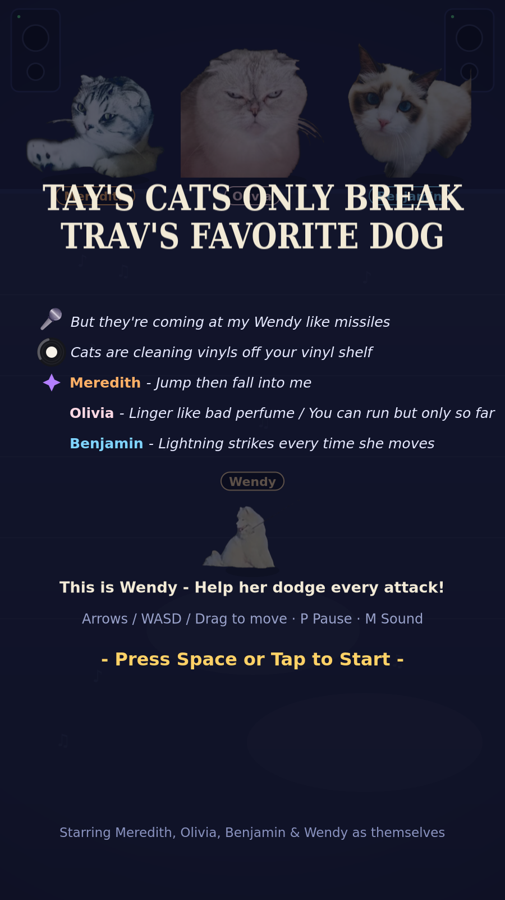

<h1 align="center">Wendy vs Cats</h1>

<blockquote>
  <em>"But they're coming at my Wendy like missiles"</em>
</blockquote>

 

  

A single-file browser dodge-'em-up called [<em>Wendy vs Cats</em>](https://wendy-vs-cats.netlify.app) — Taylor's cats (Meredith, Olivia & Benjamin) are out to break Travis's favorite dog Wendy, which is you. You cannot fight back. You can only survive.

  

The entire game — photo sprites, comic font, icons, synthesized sound — lives in **one self-contained HTML file** with zero dependencies. Download it, double-click it, play it, even offline.

## 🎮 How to play

Wendy stands at the bottom of the stage; the cats take turns attacking from their perch at the top. Dodge everything for as long as you can.

**Keyboard**
- Arrow keys / WASD — move
- `P` — pause · `M` — sound on/off · `R` — restart instantly (works mid-run!)

**Touch / mouse**
- Drag anywhere on screen to lead Wendy
- On-screen buttons (bottom-left): pause / restart / sound

## 🐾 The attackers

| Cat | Normal attack | Special attack |
| --- | --- | --- |
| **Meredith** — *"Jump then fall into me"* | Throws microphones and vinyl records | **Pounce** — a warning circle shows where she'll land |
| **Olivia** — *"Linger like bad perfume / You can run but only so far"* | Throws microphones and vinyl records | **Stink attack** — when she lifts her right paw, get away fast |
| **Benjamin** — *"Lightning strikes every time she moves"* | Throws microphones and vinyl records | **Laser eyes** — they only sweep 30°, so run circles around them |

**Survival notes**
- You have 5 hearts. They do **not** regenerate.
- A hit only shields you from that *same* attack for a moment — other attacks still hurt!
- A cat on the floor is charging a special; a cat returning to the top means a normal attack is next.
- Attacks get faster the longer you survive.

## ✨ Features

- **One file, no build step** — all art embedded as data URIs, sounds synthesized with WebAudio
- Cats heckle you with pop-up one-liners (in a hand-drawn comic font, embedded subset)
- **Persistent best run** saved to localStorage, rendered as a survival calendar — *"13 Months, 13 Days"*
- Mobile-ready: responsive letterboxed canvas, drag controls, auto-pause on tab switch, iOS audio unlock, add-to-home-screen meta
- Synthesized retro-ish SFX — every attack has its own cue

## 🎬 Cast

Starring Meredith, Olivia, Benjamin & Wendy **as themselves**.

## 📄 Credits & license

- Embedded font: [Comic Neue](https://github.com/crozynski/comicneue) (Bold subset, rendered as "WendyComic") — SIL Open Font License 1.1
- Fan-made parody inspired by Taylor Swift's cats and the TTPD aesthetic. Not affiliated with anyone.

---

*Made with love, one HTML file at a time.*
